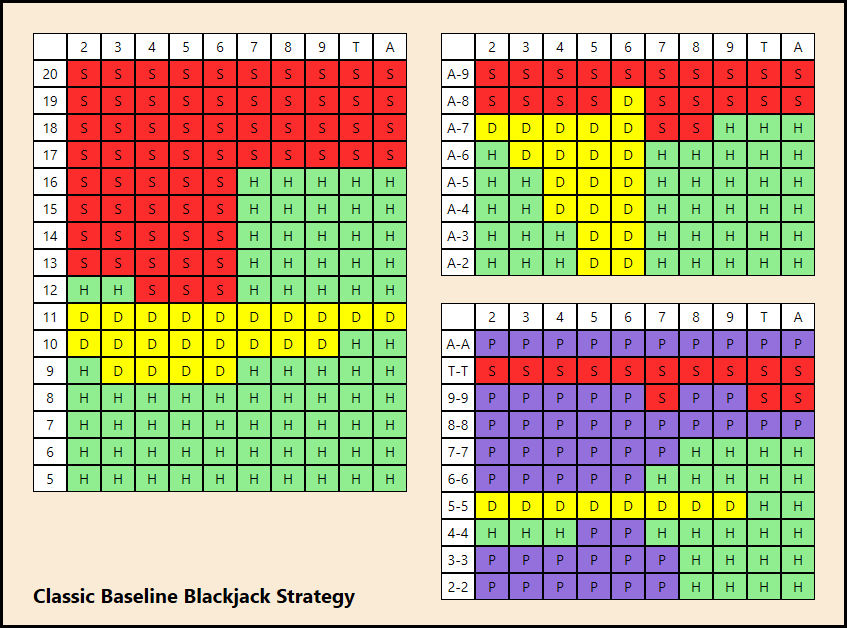

# BlackJack_AI

Contributors: Ani Hazarika

A project to create and analyse the mathematically optimal Blackjack AI.  
https://www.profitsquad.co.uk/blackjack-strategy-how-to-play-perfect-blackjack/ This website (along with many others) describes a mathematically optimal strategy to playing Blackjack giving a chart for easy execution. Even after deploying this strategy, there is always a House Edge of 0.5%, so you win always lose on average 0.5% of your money.

This project is here to test this hypothesis. First I will play Blackjack using my best intuition (interpret that as you like) to play and then see the distribution of wins/losses that I achieve. Then I will make an AI that uses this optimal method and see if it achieves a better outcome than me.  

Some of the simplifications I've made to do this project:
1. As this is an experiment seeing how this strategy fairs against the house, there will only be one player and the dealer.
2. Only one deck of cards will be used, and the deck will be shuffled after every round.
3. I will not be considering bets in terms of amount of money. Instead I will assign discrete values to wins, ties and losses.  

The chart below from https://towardsdatascience.com/winning-blackjack-using-machine-learning-681d924f197c shows the optimal strategy to Blackjack:

